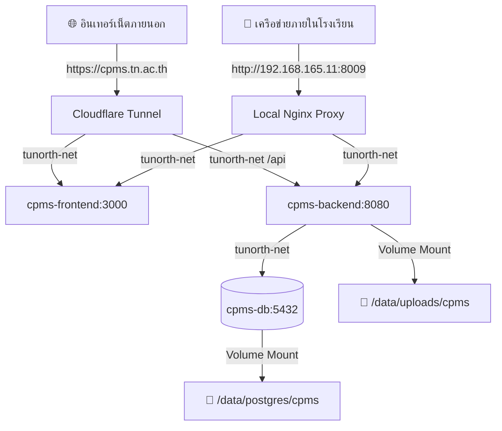

# 📘 คู่มือขั้นตอนการ Deploy เฉพาะระบบ TU-North CPMS บน Ubuntu Server (Standalone Deploy Guide)

คู่มือนี้ระบุขั้นตอนการ Deploy ระบบ **TU-North CPMS (Computer Project Management System)** แบบแยกเดี่ยว (Standalone) โดยไม่ให้ส่งผลกระทบหรือขัดจังหวะระบบอื่น ๆ (BRMS, EDMS, GPMS, OES, Hub ฯลฯ) ที่กำลังทำงานอยู่บนเครื่อง **Ubuntu Server 24.04 LTS (HP ProLiant ML350 G6)** ของโรงเรียนเตรียมอุดมศึกษา ภาคเหนือ

---

## 🏗️ 1. โครงสร้างและการเชื่อมต่อเครือข่ายของ CPMS

- **Direct LAN IP Access**: `http://192.168.165.11:8009` (หรือ Local Host `http://cpms.local`)
- **LAN Portal Menu**: `http://192.168.165.11` (เลือกเมนู `9. CPMS (ระบบจัดการโครงงานคอมพิวเตอร์)`)
- **Internet WAN Ingress**: `https://cpms.tn.ac.th` (ผ่าน Cloudflare Tunnel)
- **Database Container**: `cpms-db` (PostgreSQL 17-alpine) จัดเก็บบน Host ที่ `~/TUNorth/data/postgres/cpms`
- **Upload Deliverables Storage**: Host Volume Path `~/TUNorth/data/uploads/cpms`
- **Application Services**:
  - `cpms-backend`: Go Fiber API (Container Port 8080)
  - `cpms-frontend`: Next.js 16 App Router Standalone (Container Port 3000)



---

## 🚀 2. ขั้นตอนการ Deploy เฉพาะระบบ CPMS ครั้งแรก (First-Time Deploy)

เปิด Terminal บน Ubuntu Server แล้วรันคำสั่งตามลำดับดังนี้:

### 🔹 ขั้นที่ 1: สร้างโฟลเดอร์สำหรับเก็บข้อมูลและ Uploads ของ CPMS
```bash
# สร้างโฟลเดอร์สำหรับ Database และ Uploads ของ CPMS
mkdir -p ~/TUNorth/data/postgres/cpms
mkdir -p ~/TUNorth/data/uploads/cpms/branding

# กำหนดสิทธิ์ให้ Container สามารถเขียนไฟล์ได้สมบูรณ์
chmod -R 777 ~/TUNorth/data/uploads/cpms
```

---

### 🔹 ขั้นที่ 2: เริ่มต้นรันเฉพาะฐานข้อมูลของ CPMS (`cpms-db`)
```bash
cd ~/TUNorth/infra

# สั่งรันเฉพาะ Service cpms-db (ระบบอื่นจะไม่ถูกรีสตาร์ท)
docker compose up -d cpms-db
```

---

### 🔹 ขั้นที่ 3: นำเข้าโครงสร้างตารางและข้อมูลเริ่มต้น (Database Seeding)
```bash
cd ~/TUNorth

# รอให้ cpms-db พร้อมรับการเชื่อมต่อ แล้วนำเข้าไฟล์ SQL สำรอง
docker exec -i cpms-db psql -U postgres -d tunorth_cpms_db < tunorth-cpms_db_backup_20260727.sql
```

> [!TIP]
> ตรวจสอบว่าตารางถูกสร้างครบถ้วนหรือไม่ด้วยคำสั่ง:
> `docker exec -it cpms-db psql -U postgres -d tunorth_cpms_db -c "\dt"`

---

### 🔹 ขั้นที่ 4: รีสตาร์ท Local Nginx เพื่อเปิดรับ Port 8009
```bash
cd ~/TUNorth/infra

# รีสตาร์ทเฉพาะ Nginx เพื่อโหลด Routing Port 8009 และ Virtual Host
docker compose restart nginx
```

---

### 🔹 ขั้นที่ 5: Build และเริ่มทำงานแอปพลิเคชัน CPMS
```bash
cd ~/TUNorth/apps/cpms

# สั่ง Build Docker Image และรัน Frontend + Backend
docker compose up -d --build
```

---

### 🔹 ขั้นที่ 6: ตรวจสอบสถานะการทำงาน (Verification)
```bash
# 1. ตรวจสอบ Container สถานะ Up
docker ps --filter "name=cpms"

# 2. ดู Logs การทำงานของ Backend (Go Fiber)
docker logs -f cpms-backend

# 3. ดู Logs การทำงานของ Frontend (Next.js)
docker logs -f cpms-frontend
```

---

## 🔄 3. คำสั่งสำหรับการ Re-deploy เมื่อมีการแก้ไขโค้ด (Maintenance Commands)

### กรณีอัปเดตทั้งระบบ CPMS (ทั้ง Frontend & Backend):
```bash
cd ~/TUNorth/apps/cpms
git pull origin main
docker compose up -d --build
```

### กรณีแก้ไขเฉพาะ Frontend (Next.js):
```bash
cd ~/TUNorth/apps/cpms
docker compose up -d --build frontend
```

### กรณีแก้ไขเฉพาะ Backend (Go Fiber):
```bash
cd ~/TUNorth/apps/cpms
docker compose up -d --build backend
```

### กรณีต้องการ Restart CPMS อย่างรวดเร็ว (ไม่ Rebuild):
```bash
cd ~/TUNorth/apps/cpms
docker compose restart
```

---

## 🔑 4. ข้อมูลบัญชีผู้ใช้เริ่มต้นสำหรับทดสอบ (Default Accounts)

| Identifier / Email | Role | รหัสผ่านเริ่มต้น | รายละเอียด |
| :--- | :--- | :--- | :--- |
| `admin@tunorth.ac.th` | **ADMIN** | `admin1234` | ผู้ดูแลระบบ CPMS (Admin Control Panel) |
| `somchai@tunorth.ac.th` | **TEACHER** | `password` | คุณครูสมชาย (ครูผู้สอนประจำห้อง 6.1) |
| `student1@tunorth.ac.th` หรือ `28926` | **STUDENT** | `password` | นายสมศักดิ์ ตัวอย่าง (นักเรียนห้อง 6.1 - หัวหน้ากลุ่ม) |
| `student2@tunorth.ac.th` หรือ `28927` | **STUDENT** | `password` | นางสาวสมศรี ตัวอย่าง (นักเรียนห้อง 6.1 - สมาชิก) |
