# 📘 ข้อกำหนดความต้องการและสถาปัตยกรรมระบบ (System Specification & Requirements)
## โครงการ: TU-North CPMS (Computer Project Management System)
**หน่วยงาน**: โรงเรียนเตรียมอุดมศึกษา ภาคเหนือ (TU-North)  
**เวอร์ชันเอกสาร**: 1.0.0  
**สถานะ**: Approved / Specification Baseline  

---

## 1. ภาพรวมระบบ (System Overview)

### 1.1 วัตถุประสงค์ (Purpose)
ระบบ **TU-North CPMS (ระบบจัดการโครงงานคอมพิวเตอร์)** ถูกพัฒนาขึ้นเพื่อใช้บริหารจัดการกระบวนการทำโครงงานคอมพิวเตอร์ของนักเรียนชั้นมัธยมศึกษาปีที่ 6 โรงเรียนเตรียมอุดมศึกษา ภาคเหนือ แบบครบวงจร ตั้งแต่การรวมกลุ่มโครงงาน, การเลือกครูที่ปรึกษา, การส่งงานตามลำดับขั้นตอนและเกณฑ์กำหนดส่ง (Milestone Submissions), การตรวจประเมินและให้ข้อเสนอแนะโดยครูผู้สอน, การจองรอบนำเสนอโครงงาน (Presentation Defense Slot Booking), การประเมินคะแนนโดยคณะกรรมการหลายท่าน (Multi-Evaluator Rubric Scoring), ตลอดจนการสรุปผลคะแนนและการส่งออกข้อมูลเกรด (Grade Sheet Export)

### 1.2 สถาปัตยกรรมเทคโนโลยี (Tech Stack)
* **Frontend Framework**: Next.js 16 (App Router) + React 19 + TypeScript
* **Package Manager**: **Bun 1.3+** (*ข้อกำหนดเข้มงวด: ใช้งาน Bun ในทุกคำสั่ง ห้ามใช้ npm, yarn หรือ pnpm โดยเด็ดขาด*)
* **UI & Styling**: Tailwind CSS (v4) + Shadcn/ui + Lucide React + Sonner Toast
* **Client State Management**: Zustand
* **Typography**: Google Fonts **Prompt** (ภาษาไทย) และ **Inter** (ภาษาอังกฤษ/ตัวเลข) รองรับ Light / Dark Mode
* **Backend Framework**: Go 1.26 + Fiber v2
* **ORM & Database Tool**: GORM + PostgreSQL pgx Driver + Air (Live Reload)
* **Database**: PostgreSQL 17 (Container: `cpms-db`, Database Name: `tunorth_cpms_db`)
* **DevOps & Infrastructure**:
  * Docker Compose บน Docker Network ภายใน `tunorth-net`
  * Local Nginx Reverse Proxy (Direct LAN IP Access Port `8009` และ `cpms.local`, รวมทั้ง Portal Menu บน Port `80`)
  * Cloudflare Tunnel สำหรับการเข้าถึงผ่านอินเทอร์เน็ตสาธารณะที่โดเมน `https://cpms.tn.ac.th`
  * Daily Automated Backup Script (`/scripts/backup.sh`) ตั้งเวลา Cron Job ทุกวัน เวลา 02:00 น.
  * Server Host: Ubuntu Server 24.04 LTS (HP ProLiant ML350 G6)

### 1.3 สิทธิ์และผู้ใช้งาน (User Roles & RBAC)
1. **ADMIN (ผู้ดูแลระบบ)**: ควบคุมดูแลระบบทั้งหมด, จัดการบัญชีผู้ใช้ (CRUD / CSV Import), มอบหมายห้องเรียนให้ครูผู้สอน, กำหนดขั้นตอนงานและเกณฑ์ Rubric, จัดการรอบนำเสนอ, ดูภาพรวมความคืบหน้า (Progress Matrix), จัดการปีการศึกษา และตั้งค่าระบบ
2. **TEACHER (ครูผู้สอน / ครูที่ปรึกษา / กรรมการ)**: ตรวจงานและให้คะแนนขั้นตอนโครงงานของห้องที่รับผิดชอบ, ติดตามความคืบหน้าของนักเรียน, เป็นกรรมการร่วมประเมินการนำเสนอโครงงานตาม Rubric, และส่งออกใบคะแนน
3. **STUDENT (นักเรียน)**: สร้างกลุ่มโครงงาน, เชิญ/ลบสมาชิก (อนุญาตข้ามห้องเรียนตามโควตา), เลือกครูที่ปรึกษา, ส่งไฟล์งาน (<=20MB) หรือลิงก์โครงงาน, ติดตามผลตรวจ/ข้อเสนอแนะ, จองรอบนำเสนอ และดูผลคะแนน

---

## 2. โครงสร้างข้อมูลและฐานข้อมูล (Data Model & Schema)

### 2.1 แผนภาพความสัมพันธ์ของข้อมูล (Entity-Relationship Diagram)

```mermaid
erDiagram
    USERS ||--o{ GROUP_MEMBERS : "joins"
    USERS ||--o{ TEACHER_ASSIGNMENTS : "assigned to room"
    USERS ||--o{ PRESENTATION_SCORES : "evaluates"
    USERS ||--o{ ACTIVITY_LOGS : "performs"
    USERS ||--o{ ANNOUNCEMENTS : "publishes"

    PROJECT_GROUPS ||--|{ GROUP_MEMBERS : "contains members"
    PROJECT_GROUPS ||--o{ SUBMISSIONS : "submits work"
    PROJECT_GROUPS ||--o| PRESENTATION_BOOKINGS : "books defense slot"
    PROJECT_GROUPS }o--|| ACADEMIC_YEARS : "belongs to year"

    PROJECT_STEPS ||--o{ SUBMISSIONS : "step requirement"
    PRESENTATION_SLOTS ||--o{ PRESENTATION_BOOKINGS : "holds bookings"
    PRESENTATION_BOOKINGS ||--o{ PRESENTATION_SCORES : "graded by committee"

    USERS {
        uuid id PK
        string student_id UK "Nullable for Teachers/Admin"
        string email UK
        string password_hash
        string full_name
        string role "ADMIN | TEACHER | STUDENT"
        string room "e.g. 6.1, 6.2 (Student class)"
        string academic_year "e.g. 2568 (Student cohort)"
        boolean is_active
        timestamp created_at
        timestamp updated_at
    }

    PROJECT_GROUPS {
        uuid id PK
        string project_name_th
        string project_name_en
        uuid advisor_id FK "References USERS(id)"
        string advisor_name
        string academic_year
        string room "Primary class / representative room"
        timestamp created_at
        timestamp updated_at
    }

    GROUP_MEMBERS {
        uuid id PK
        uuid group_id FK "References PROJECT_GROUPS(id) ON DELETE CASCADE"
        uuid user_id FK "References USERS(id) ON DELETE CASCADE"
        boolean is_leader
        timestamp joined_at
    }

    PROJECT_STEPS {
        uuid id PK
        string step_name
        text description
        integer step_order
        string file_form_path "Template download (file or url)"
        string file_example_path "Example document (file or url)"
        timestamp deadline
        boolean is_active
        numeric max_score
        timestamp created_at
        timestamp updated_at
    }

    SUBMISSIONS {
        uuid id PK
        uuid group_id FK "References PROJECT_GROUPS(id) ON DELETE CASCADE"
        uuid step_id FK "References PROJECT_STEPS(id) ON DELETE CASCADE"
        uuid submitted_by FK "References USERS(id)"
        string submission_type "file | link"
        string file_path "Upload path or external URL"
        string status "PENDING | APPROVED | REJECTED"
        text comment
        numeric score
        integer revision_number "Increments on re-submission"
        timestamp submitted_at
        timestamp reviewed_at
    }

    PRESENTATION_SLOTS {
        uuid id PK
        string academic_year
        timestamp start_time
        timestamp end_time
        string location "Room / Laboratory name"
        integer max_groups "Default 1"
        timestamp created_at
        timestamp updated_at
    }

    PRESENTATION_BOOKINGS {
        uuid id PK
        uuid slot_id FK "References PRESENTATION_SLOTS(id) ON DELETE CASCADE"
        uuid group_id FK "References PROJECT_GROUPS(id) ON DELETE CASCADE"
        timestamp booked_at
    }

    PRESENTATION_CRITERIA {
        uuid id PK
        string label "Criterion title"
        text description
        numeric max_score
        integer criteria_order
        boolean is_active
        timestamp created_at
    }

    PRESENTATION_SCORES {
        uuid id PK
        uuid booking_id FK "References PRESENTATION_BOOKINGS(id) ON DELETE CASCADE"
        uuid scorer_id FK "References USERS(id)"
        jsonb criteria_data "Map of criterion_id to score"
        numeric total_score
        text comments
        timestamp scored_at
        timestamp updated_at
    }

    TEACHER_ASSIGNMENTS {
        uuid id PK
        uuid teacher_id FK "References USERS(id) ON DELETE CASCADE"
        string room "e.g. 6.1, 6.2"
        timestamp created_at
    }

    ACADEMIC_YEARS {
        uuid id PK
        string year "e.g. 2568"
        string term "1 | 2"
        boolean is_current
        boolean is_active
        timestamp created_at
    }

    SYSTEM_SETTINGS {
        string key PK
        text value
        timestamp updated_at
    }

    ANNOUNCEMENTS {
        uuid id PK
        string title
        text content
        boolean is_pinned
        uuid created_by FK "References USERS(id)"
        timestamp created_at
        timestamp updated_at
    }

    ACTIVITY_LOGS {
        uuid id PK
        uuid user_id FK "References USERS(id)"
        string user_role
        string action
        text description
        string ip_address
        timestamp created_at
    }
```

---

## 3. ฟีเจอร์ทั้งหมดและเกณฑ์การยอมรับ (Features & Acceptance Criteria)

### Module 1: ระบบยืนยันตัวตนและการจัดการสิทธิ์ (Authentication & RBAC)
* **Feature 1.1: เข้าสู่ระบบแบบยืดหยุ่น (Dual Login Identifier)**
  * **Description**: นักเรียนสามารถเข้าสู่ระบบด้วย **รหัสนักเรียน (Student ID)** หรือ **Email** ควบคู่กับรหัสผ่าน ครูและแอดมินเข้าสู่ระบบด้วย **Email**
  * **Acceptance Criteria**:
    1. ฟอร์ม Login รับค่า Identifier เดียว (ตรวจจับอัตโนมัติว่าเป็น Email หรือ Student ID)
    2. รหัสผ่านถูก Hash ด้วย `bcrypt` อย่างปลอดภัย
    3. ส่งกลับ JWT Access Token (อายุ 2 ชั่วโมง) และ Refresh Token (อายุ 7 วัน)
    4. แสดง Toast แจ้งเตือนข้อผิดพลาดชัดเจนหากรหัสผ่านไม่ถูกต้อง หรือบัญชีถูกระงับ
* **Feature 1.2: จัดการโปรไฟล์และเปลี่ยนรหัสผ่าน (User Profile & Security)**
  * **Description**: ผู้ใช้สามารถดูข้อมูลตนเองและเปลี่ยนรหัสผ่านได้
  * **Acceptance Criteria**:
    1. ผู้ใช้ต้องระบุรหัสผ่านเดิมถูกต้องก่อนตั้งรหัสผ่านใหม่
    2. รหัสผ่านใหม่ต้องมีความยาวไม่น้อยกว่า 6 ตัวอักษร
* **Feature 1.3: แอดมินจัดการผู้ใช้และนำเข้าข้อมูล (Admin User Management & CSV Import)**
  * **Description**: แอดมินสามารถเพิ่ม, แก้ไข, ลบ, ค้นหา, Reset รหัสผ่าน และนำเข้ารายชื่อนักเรียน/ครูจากไฟล์ CSV
  * **Acceptance Criteria**:
    1. รองรับ CSV Header: `full_name, email, password, role, student_id, room`
    2. ระบบข้ามข้อมูลที่ Email หรือ Student ID ซ้ำ และรายงานจำนวนที่สำเร็จ/ข้าม
    3. แอดมินสามารถสั่ง Reset รหัสผ่านของผู้ใช้คนใดก็ได้

---

### Module 2: ระบบจัดการกลุ่มโครงงาน (Project Group Management)
* **Feature 2.1: สร้างกลุ่มโครงงาน (Group Creation)**
  * **Description**: นักเรียนที่ยังไม่มีกลุ่มสามารถสร้างกลุ่มใหม่ ระบุชื่อโครงงาน (ไทย/อังกฤษ), ปีการศึกษา, และเลือกครูที่ปรึกษา
  * **Acceptance Criteria**:
    1. ผู้สร้างกลุ่มจะได้รับสถานะ Leader โดยอัตโนมัติ
    2. นักเรียน 1 คนสามารถมีกลุ่มได้เพียง 1 กลุ่มเท่านั้น
    3. ส่งข้อความแจ้งเตือนเข้า Telegram ครูที่ปรึกษาเมื่อมีการสร้างกลุ่มใหม่
* **Feature 2.2: การเพิ่ม/ลบสมาชิกข้ามห้องเรียน (Cross-Room Membership Management)**
  * **Description**: หัวหน้ากลุ่มสามารถค้นหาเพื่อนนักเรียนที่ยังไม่มีกลุ่ม (แสดงห้องและชื่อ) เพื่อเพิ่มเข้ากลุ่ม หรือลบสมาชิกออก
  * **Acceptance Criteria**:
    1. สมาชิกสามารถอยู่คนละห้องเรียนได้ (เช่น หัวหน้าอยู่ 6.1 เพื่อนอยู่ 6.2)
    2. จำนวนสมาชิกต้องไม่เกิน `max_members_per_group` (กำหนดใน System Settings)
    3. ระบบป้องกันไม่ให้นักเรียนที่มีกลุ่มแล้วถูกดึงซ้ำ
* **Feature 2.3: ยุบกลุ่มโครงงานพร้อมคืนพื้นที่ (Group Dissolution & Disk Cleanup)**
  * **Description**: หัวหน้ากลุ่มสามารถขอยุบกลุ่มได้
  * **Acceptance Criteria**:
    1. เมื่อยุบกลุ่ม ข้อมูลสมาชิก, การส่งงาน, การจองรอบนำเสนอ จะถูกลบ (Cascade)
    2. ไฟล์งานที่เคยอัปโหลดไว้บน Disk จะถูกลบออกจาก Server เพื่อคืนพื้นที่จัดเก็บ

---

### Module 3: ระบบขั้นตอนการส่งงานและการตรวจประเมิน (Step Submissions & Grading)
* **Feature 3.1: จัดการขั้นตอนส่งงาน (Step Configuration)**
  * **Description**: แอดมินสามารถเพิ่ม/แก้ไขขั้นตอนงาน, อัปโหลดแบบฟอร์ม (Template) หรือใส่ Link ตัวอย่าง, กำหนดลำดับ, กำหนดวันส่ง (Deadline), และคะแนนเต็ม
  * **Acceptance Criteria**:
    1. รองรับการแนบไฟล์ PDF/Word หรือ External Link (Google Docs/Drive)
    2. สามารถเปิด/ปิดการใช้งานขั้นตอน หรือสลับโหมดส่งงานแบบ Sequential หรือ Open
* **Feature 3.2: การส่งงานของนักเรียน (Deliverable Submission & Revision History)**
  * **Description**: นักเรียนในกลุ่มส่งงานตามขั้นตอน โดยเลือกได้ว่าจะอัปโหลดไฟล์ (PDF/Word/PPTX/Image <= 20MB) หรือส่งลิงก์ (URL)
  * **Acceptance Criteria**:
    1. กรณีโหมด Sequential: นักเรียนจะส่งขั้นที่ N ได้ก็ต่อเมื่อขั้นที่ N-1 ได้รับสถานะ `APPROVED` แล้ว
    2. บันทึกประวัติการส่งใหม่ (Revision History) และเปลี่ยนสถานะเป็น `PENDING`
    3. ส่งการแจ้งเตือน Telegram อัตโนมัติไปยังกลุ่มครูผู้สอน
* **Feature 3.3: การตรวจงานและให้คะแนนของครู (Teacher Review & Feedback)**
  * **Description**: ครูผู้สอนในห้องที่ได้รับมอบหมายสามารถเปิดดูไฟล์งาน/ลิงก์, ให้สถานะ (`APPROVED` หรือ `REJECTED`), บันทึกคะแนน และเขียนคอมเมนต์
  * **Acceptance Criteria**:
    1. ครูเห็นเฉพาะคิวส่งงานของห้องตนเอง หรือกลุ่มที่ตนเป็นที่ปรึกษา
    2. เมื่อครูตรวจเสร็จ สถานะจะอัปเดตทันที และส่งแจ้งเตือน Telegram ถึงนักเรียน
* **Feature 3.4: ตารางความคืบหน้าและการส่งออกคะแนน (Progress Matrix & Grade Export)**
  * **Description**: ครูและแอดมินสามารถดู Matrix สรุปความคืบหน้าของทุกกลุ่มแยกตามห้อง และ Export เป็นไฟล์ CSV
  * **Acceptance Criteria**:
    1. ตาราง Matrix แสดงสถานะและคะแนนของแต่ละขั้นตอนแบบ Real-time
    2. ส่งออกไฟล์ CSV พร้อม UTF-8 BOM แสดงภาษาไทยใน Microsoft Excel ได้ถูกต้อง

---

### Module 4: ระบบการนำเสนอโครงงานและเกณฑ์ Rubric (Presentation Defense & Scoring)
* **Feature 4.1: จัดการรอบนำเสนอ (Defense Slots Management)**
  * **Description**: แอดมินและครูกำหนดช่วงวัน เวลา สถานที่ และจำนวนกลุ่มสูงสุดต่อรอบ
  * **Acceptance Criteria**:
    1. แสดงมุมมองปฏิทินรายสัปดาห์ (Weekly View) และรายการรอบที่เปิดให้จอง
    2. ป้องกันการลบรอบที่มีกลุ่มนักเรียนทำการจองแล้ว
* **Feature 4.2: การจองและยกเลิกรอบนำเสนอ (Student Defense Booking)**
  * **Description**: กลุ่มนักเรียนที่ผ่านเกณฑ์สามารถเลือกจองรอบนำเสนอได้ 1 รอบต่อกลุ่ม
  * **Acceptance Criteria**:
    1. ระบบตรวจสอบความจุของรอบ (ไม่เกิน `max_groups`)
    2. อนุญาตให้ยกเลิกและเปลี่ยนรอบได้ก่อนถึงกำหนดเวลา
* **Feature 4.3: เกณฑ์การประเมิน Rubric (Full CRUD & Customizable Rubric Criteria)**
  * **Description**: แอดมินสามารถบริหารจัดการเกณฑ์การประเมินการนำเสนอโครงงานแบบ Full CRUD ประกอบด้วย การสร้างเกณฑ์ใหม่, แก้ไขข้อมูลเกณฑ์เดิม, ลบเกณฑ์ที่ไม่ใช้งาน, สลับสถานะเปิด/ปิดใช้งาน (Toggle Active), และการจัดลำดับการประเมิน (Reorder)
  * **Acceptance Criteria**:
    1. แอดมินสามารถเพิ่มเกณฑ์ใหม่พร้อมระบุหัวข้อ (`label`), คำอธิบายเกณฑ์และแนวทางการให้คะแนน (`description`), คะแนนเต็ม (`max_score`), ลำดับ (`criteria_order`), และสถานะเปิดใช้งาน (`is_active`)
    2. รองรับการแก้ไขข้อมูลเกณฑ์เดิมและสลับสถานะเปิด/ปิดใช้งานได้ทันทีจากหน้าจอรายการเกณฑ์ (Quick Toggle Active/Inactive)
    3. รองรับการปรับลำดับเกณฑ์ขึ้น/ลง (Move Up / Down) ด้วยปุ่มลูกศร และส่งอัปเดตแบบ Batch ไปยัง `PUT /api/v1/presentation/criteria/reorder`
    4. คำนวณและแสดงคะแนนเต็มรวมของทุกเกณฑ์ที่เปิดใช้งาน (Total Rubric Points) แบบ Real-time บนหน้าจอผู้ดูแลระบบ
    5. เกณฑ์ที่เปิดใช้งาน (`is_active = true`) จะถูกส่งต่อไปยังฟอร์มการประเมินของครูและกรรมการ (`GET /api/v1/presentation/criteria?active_only=true`)
    6. ทุกการสร้าง, แก้ไข, ลบ, และจัดลำดับเกณฑ์ Rubric จะถูกบันทึกประวัติการกระทำลงในระบบ Audit Activity Logs อัตโนมัติ
* **Feature 4.4: การประเมินคะแนนโดยคณะกรรมการหลายท่าน (Multi-Evaluator Scoring & Analytics)**
  * **Description**: ครูหลายท่านสามารถเข้าประเมินกลุ่มเดียวกันในรอบนำเสนอ โดยกรอกคะแนนตามแต่ละเกณฑ์ Rubric พร้อมข้อเสนอแนะ
  * **Acceptance Criteria**:
    1. ระบบบันทึกคะแนนแยกรายกรรมการ พร้อมคำนวณคะแนนรวมและคะแนนเฉลี่ยอัตโนมัติ
    2. แปลงผลคะแนนเฉลี่ยเป็นสัดส่วนน้ำหนักคะแนนตามเกณฑ์ของโรงเรียน (เช่น 20%)
    3. ส่งออกรายงานผลคะแนนการนำเสนอสรุปทุกกลุ่มเป็นไฟล์ CSV พร้อมรายละเอียดรายกรรมการ

---

### Module 5: ระบบตั้งค่า การจัดการปีการศึกษา และการดูแลระบบ (Settings, Academic Years & DevOps)
* **Feature 5.1: ระบบจัดการปีการศึกษาและภาคเรียน (Academic Year Management)**
  * **Description**: แอดมินสามารถเพิ่ม, แก้ไข, ลบอย่างปลอดภัย, ควบคุมสถานะเปิด/ปิดใช้งาน, และสลับปีการศึกษาปัจจุบัน (1-Click Set Current Year)
  * **Acceptance Criteria**:
    1. แอดมินสามารถสร้างปีการศึกษาและระบุภาคเรียน (เทอม 1, เทอม 2, ภาคฤดูร้อน)
    2. ปุ่ม 👑 ตั้งเป็นปีปัจจุบัน จะปรับปรุง `is_current = true` และ sync ค่าไปยัง `system_settings` (`academic_year` & `academic_term`) อัตโนมัติ
    3. ระบบคำนวณและแสดงจำนวนกลุ่มโครงงาน (`group_count`) ในแต่ละปีแบบ real-time
    4. ระบบตรวจสอบความปลอดภัย (บล็อกการลบปีปัจจุบัน หรือปีที่มีกลุ่มโครงงานสังกัดอยู่)
    5. เชื่อมต่อตัวเลือกปีการศึกษาแบบ Dynamic ไปยังหน้าต่างและตัวกรองของนักเรียน ครู และแอดมิน
* **Feature 5.2: การตั้งค่าระบบส่วนกลาง (Centralized Admin System Settings & Release Info)**
  * **Description**: แอดมินบริหารจัดการการตั้งค่าระบบครอบคลุม 6 หมวดหมู่อย่างครบวงจร:
    1. **ทั่วไป (General)**: ชื่อระบบ, ชื่อสถาบัน, คำอธิบายระบบ, สมาชิกสูงสุดต่อกลุ่ม (`max_members_per_group`), ลิขสิทธิ์ (`site_copyright`)
    2. **รูปภาพ (Images & Branding)**: Site Logo & Favicon รองรับการอัปโหลดไฟล์รูปภาพ (PNG, JPG, SVG, WebP, ICO <= 5MB) ผ่าน `POST /api/v1/admin/settings/upload-image` และใส่ URL พร้อม Live Preview และซิงค์การแสดงผลบน Navbar, Dynamic `<head>` Favicon, และหน้า Login ทันที
    3. **รูปแบบการส่งงาน (Submission Mode)**: เลือกระหว่าง **Sequential (ตามลำดับ)** (ต้องผ่านงานก่อนหน้าจึงจะส่งขั้นถัดไปได้ พร้อมระบบล็อกอัตโนมัติ) และ **Open (อิสระ)** (ส่งงานขั้นตอนใดก่อนก็ได้)
    4. **การให้คะแนน (Grading Visibility)**: เปิด/ปิดการแสดงผลคะแนนแก่นักเรียน (`show_scores_to_students`: on/off) ซึ่งจะ Mask คะแนนขั้นตอนและ Rubric ในมุมมองนักเรียน
    5. **การแจ้งเตือน (Notifications & Telegram Bot)**: สวิตช์ Master เปิด/ปิดการแจ้งเตือน, กำหนด Bot Token พร้อมปุ่ม Toggle แสดง/ซ่อนรหัสผ่าน, Chat ID และปุ่มทดสอบส่งข้อความแจ้งเตือน
    6. **ข้อมูลเวอร์ชันและการเชื่อมต่อเครือข่าย (System Version & Network Deployment)**: แสดงข้อมูลรุ่นเวอร์ชัน `v1.0 (Production Release)`, ป้ายสถานะ `พร้อมใช้งานบน LAN และ Cloudflare`, ที่อยู่เครือข่ายภายในโรงเรียน (`lan_url`: `http://cpms.local`) และที่อยู่ออนไลน์ภายนอก (`cloudflare_url`: `https://cpms.tn.ac.th`)
  * **Acceptance Criteria**:
    1. บันทึกและมีผลต่อการทำงานของระบบทันทีแบบ Real-time โดยไม่ต้อง Restart Container
    2. ระบบตรวจสอบสิทธิ์ความปลอดภัย และบันทึก Audit Logs ทุกครั้งที่มีการอัปเดตหรืออัปโหลดรูปภาพ
* **Feature 5.3: การแจ้งเตือน Telegram Bot (Telegram Bot Alerts)**
  * **Description**: แจ้งเตือนเหตุการณ์สำคัญไปยังกลุ่มครูและนักเรียน
  * **Acceptance Criteria**:
    1. แอดมินสามารถทดสอบการเชื่อมต่อ Bot Token และ Chat ID ผ่านหน้า Settings ได้
* **Feature 5.4: บันทึกกิจกรรมและความปลอดภัย (Activity Audit Logs)**
  * **Description**: บันทึกทุก Action สำคัญ (Login, สร้างกลุ่ม, ส่งงาน, ตรวจงาน, ให้คะแนน) พร้อม IP Address และวันเวลา
  * **Acceptance Criteria**:
    1. แอดมินสามารถค้นหาและ Filter บันทึก Logs ตามผู้ใช้, บทบาท, หรือช่วงเวลาได้
* **Feature 5.5: การเข้าถึงและการใช้งาน Modal ทั่วทั้งระบบ (Universal Accessible Modals)**
  * **Description**: ทุกหน้าต่าง Modal ในระบบรองรับการปิดด้วยปุ่ม `ESC` และการคลิกนอกพื้นที่ (Backdrop Click) พร้อมล็อกการเลื่อนหน้าเว็บพื้นหลัง

---

## 4. แผนการพัฒนาและ Checklist งานย่อย (Phased Implementation Plan)

### 📌 Phase 1: การเตรียมโครงสร้างพื้นฐานและฐานข้อมูล (Infrastructure, Docker & Database Setup)
- [x] สร้างโครงสร้างโฟลเดอร์โปรเจกต์ `apps/cpms/backend`, `apps/cpms/frontend` และ `apps/cpms/docs`
- [x] เพิ่ม Service `cpms-db` (PostgreSQL 17-alpine) ใน `D:\TUNorth\infra\docker-compose.yml`
- [x] แก้ไข `D:\TUNorth\infra\nginx\nginx.conf` เพิ่มบล็อก Reverse Proxy สำหรับ Port `8009`, Virtual Hosts (`cpms.local`, `cpms.tn.ac.th`) และอัปเดตเมนูใน LAN Portal (Port 80)
- [x] อัปเดต Shell Scripts ใน `D:\TUNorth\scripts\deploy.sh` และ `D:\TUNorth\scripts\backup.sh`
- [x] สร้างสคริปต์ Data Migration และ Seeder เพื่อแปลงข้อมูลจาก `backup_cpms_db.sql` เข้าสู่ PostgreSQL 17
- [x] ตรวจสอบการเชื่อมต่อ Database และ Volume Persistence บนเครื่อง Server

---

### 📌 Phase 2: การพัฒนา Backend ด้วย Go, Fiber และ GORM (`apps/cpms/backend`)
- [x] Initialized Go module (`go.mod`) พร้อมติดตั้ง Fiber v2, GORM, pgx, jwt-go, crypto, godotenv
- [x] กำหนดค่า Configuration, Database Connection Pool, Logger, CORS, Recovery Middleware
- [x] สร้าง GORM Models ทั้งหมดตาม Schema ในข้อ 2 (Users, Groups, Steps, Submissions, Presentation, Scores, Settings, Logs, AcademicYears)
- [x] สร้างระบบ Authentication, JWT Generation, Password Hashing, และ RBAC Middleware (`AdminGuard`, `TeacherGuard`, `StudentGuard`)
- [x] พัฒนา Controller & Routes:
  - [x] Auth Controller (Login ด้วย Student ID/Email, Profile, Change Password, Refresh)
  - [x] Project Group Controller (Create, Update, Delete/Dissolve, Add/Remove Members, Search Available Students, Teacher List, Transfer Leader 👑)
  - [x] Step & Submission Controller (Step CRUD, File/Link Uploads <=20MB, Revision History, Review & Grading, Sequential Lock Validator, Score Masking)
  - [x] Presentation Controller (Slot Management, Booking, Rubric Criteria CRUD, Multi-Evaluator Scoring, Score CSV Export)
  - [x] Teacher Controller (Pending Submissions Queue, Class Progress Matrix, Grade Sheet CSV Export)
  - [x] Admin Controller (User CRUD + CSV Import, Teacher-Room Assignment, Academic Years CRUD & 1-Click Set Current, System Settings 6 Sections, Image Upload API, Activity Logs)
- [x] พัฒนา Telegram Notification Service แบบ Asynchronous (Goroutine)
- [x] ติดตั้งและตั้งค่า Air สำหรับ Live Reload (`.air.toml`)
- [x] สร้าง Dockerfile สำหรับ Backend (`golang:1.26-alpine` Multi-stage build)

---

### 📌 Phase 3: การพัฒนา Frontend ด้วย Next.js 16 และ Bun (`apps/cpms/frontend`)
- [x] ติดตั้ง Next.js 16 App Router ด้วย **Bun** (`bun create next-app . --typescript --tailwind --app`)
- [x] ติดตั้ง UI Components (Shadcn/ui, Lucide Icons, Sonner Toast, Zustand, clsx, tailwind-merge) ด้วย **Bun**
- [x] ตั้งค่า Fonts Google **Prompt & Inter** และธีมสีระบบ (Primary `#5f06c4`, Adaptive Light/Dark Mode)
- [x] สร้าง API Client และ Helper `api.getFileUrl()` สำหรับ Resolve รูปภาพข้าม Port
- [x] สร้าง State Management ด้วย Zustand (Auth Store, UI Store, Filter Store)
- [x] พัฒนา Layout และ Shared Components:
  - [x] Navigation Bar (Dynamic Logo, Dynamic System Name, Version Badge `v1.0`)
  - [x] Sidebar, Theme Toggle, User Dropdown, Toast Notifications
  - [x] Dynamic Favicon & Title Component (`dynamic-branding.tsx`)
  - [x] Reusable Modal Component (`modal.tsx` with ESC & Backdrop dismiss)
- [x] พัฒนาหน้าจอระบบย่อย:
  - [x] `/(auth)/login`: หน้ายืนยันตัวตนรองรับ Student ID / Email พร้อม Dynamic Logo มุมซ้ายบน และ Footer จาก System Settings
  - [x] `/(dashboard)/student`: หน้าข้อมูลกลุ่มโครงงาน, การแก้ไขข้อมูลกลุ่ม, ไทม์ไลน์ขั้นตอนส่งงานพร้อมระบบล็อกตามลำดับ, ป๊อปอัปส่งไฟล์/ลิงก์, หน้าจองรอบนำเสนอ, ผลคะแนนพร้อมระบบซ่อนคะแนน
  - [x] `/(dashboard)/teacher`: หน้ารายการตรวจงานรอตรวจ, ตาราง Progress Matrix ของห้องตนเอง, โมดอลตรวจงาน/ให้คะแนน, หน้ากรรมการประเมิน Rubric, ปุ่ม Export ใบคะแนน CSV
  - [x] `/(dashboard)/admin`: หน้า Dashboard ภาพรวม, จัดการผู้ใช้ (Filter, Pagination, CSV Template, CSV Import, Password Reset), จัดการกลุ่มโครงงาน (แต่งตั้งหัวหน้า, จัดการสมาชิก), จัดการปีการศึกษา (CRUD & 1-Click Set Current), มอบหมายห้องเรียนครู, กำหนดขั้นตอนงาน, จัดการรอบและเกณฑ์ Rubric, ตั้งค่าระบบ 6 หมวดหมู่ (ทั่วไป, รูปภาพ Logo/Favicon, Submission Mode, Score Visibility, Telegram Bot, Version & LAN/Cloudflare Deployment), หน้ารายการ Logs
- [x] สร้าง Dockerfile สำหรับ Frontend โดยใช้ `oven/bun:1-alpine` Multi-stage build

---

### 📌 Phase 4: การทดสอบความถูกต้อง การเชื่อมโยงระบบ และการส่งมอบ (Testing & Deployment)
- [x] ทดสอบ Build Backend (`go build -o server.exe ./cmd/server`) สำเร็จเรียบร้อย (0 Errors)
- [x] ทดสอบ Build Frontend (`bun run build`) สำเร็จเรียบร้อย (0 TypeScript errors, 0 ESLint errors)
- [x] ทดสอบ Data Migration นำเข้าข้อมูลเดิมจาก `backup_cpms_db.sql` และตรวจสอบความถูกต้องของข้อมูล
- [x] ทดสอบ User Flow แบบ End-to-End ครบทั้ง 3 บทบาท (Admin, Teacher, Student)
- [x] จัดเตรียมไฟล์ Containerization & Deployment:
  - [x] สร้าง `apps/cpms/docker-compose.yml` เชื่อมโยง `cpms-backend` (Port 8080) และ `cpms-frontend` (Port 3000) เข้า `tunorth-net`
  - [x] สร้าง `apps/cpms/.env.example` และ `apps/cpms/.env` สำหรับ Production Deployment
  - [x] อัปเดต `scripts/setup.sh` และ `scripts/restore_db.sh` รองรับ `cpms-db`
  - [x] วางไฟล์สำรองฐานข้อมูล `tunorth-cpms_db_backup_20260727.sql` ไว้ที่รูท `D:\TUNorth`
  - [x] จัดทำคู่มือ Deploy เฉพาะระบบ CPMS ใน [`docs/cpms_standalone_deploy_plan.md`](docs/cpms_standalone_deploy_plan.md)
  - [x] ปรับปรุงคู่มือกลางของเซิร์ฟเวอร์ [`DEPLOYMENT_GUIDE.md`](../../DEPLOYMENT_GUIDE.md)
- [x] ตั้งค่า `.gitignore` ยกเว้น `old_system/`, build outputs, binaries และ environment files
- [x] Push ซอร์สโค้ดและเอกสารทั้งหมดขึ้น GitHub Repository (`https://github.com/NOGiTTiS/CPMS.git`)
- [x] จัดทำเอกสารสรุปผลการทำงาน (Walkthrough Document, Handover Summary) และคู่มือสเปกระบบฉบับสมบูรณ์

